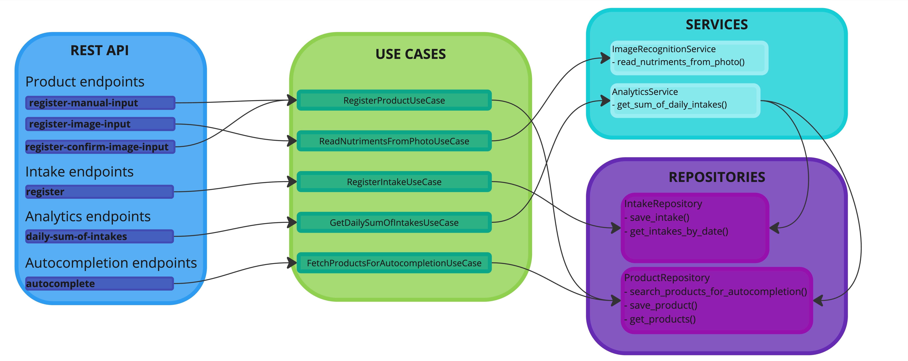

# FoodTrack

## Overview

FoodTrack is a web application designed to assist users in monitoring their daily food intake and analyzing their nutritional habits. The application enables users to register food products either manually or through image recognition, log their daily intake, and visualize their nutritional analytics over time.

## Setup

1. **Clone the Repository**

   Begin by cloning the repository to your local machine.

2. **Environment Setup**

   FoodTrack supports two dependency managers: PDM and pip. To set up the environment, execute one of the following commands:

   ```bash
   make setup method=pip
   ```

   or

   ```bash
   make setup method=pdm
   ```

3. **Configure Environment Variables**

   Populate the newly created `.env` file with the necessary values.

4. **Run the Application**

   Execute the following command to start the application:

   ```bash
   python src/main.py
   ```

## Features

### 1. Product Registration

Effortlessly save products and their nutritional details in a database through:

- **Manual Input**: Enter product nutritional information manually.
- **Image-Based Registration**: Utilize AI recognition to register products by capturing an image of the packaging, allowing AI to extract nutritional information.

### 2. Intake Tracking

Log your consumption using registered products:

- **Autocomplete Mechanism**: A user-friendly autocomplete feature facilitates the selection of the correct product.
- **Quantity Registration**: Record the quantity of a consumed product.

### 3. Analytics

Visualize your nutritional habits over time using the analytics tab:

- **Calorie Intake Visualization**: View daily calorie intake over a custom date range.
- **Macronutrient Tracking**: Monitor proteins, carbohydrates, and fats.
- **Interactive Charts**: Engage with dynamic and interactive charts.

### 4. Deployment

Deploy FoodTrack via Ngrok to make your app accessible from anywhere, not just your local network. Ensure the `.env` file is correctly configured.

### 5. Project Structure



### 6. Current Implementations of Services

FoodTrack currently supports the following implementations:

- **Repositories for Product/Intake/Analytics**: SQLite
- **Image Recognition Service**: OpenAI (GPT-4-turbo)
- **Deployment**: Ngrok